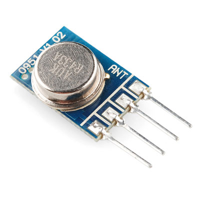

# Project: Elro-Switches

In this sample project, we want to be able to use our RaspberryPi to switch the lights on and off. 
We will be using 

* a Elro-RF-Remote-Switch, which operates at 433 MHz
* a little RF-Link-Transmitter, to send the signals
* some code that knows how to send the correct signals

## Elro Switch

First we need a RF-remote-switch. Here in Europe Elro sells a lot of [these things](https://www.google.de/search?q=elro+ab440). We will be using a switch from the ab440-series, since they have dip-switches on the back, which will be used to specify a `key` and a `device` (think of it as IDs to select which lights to switch). Both will be parameters to our script.


This switch will be connected to an outlet and to a lamp (or what ever you want to switch).


## RF Link Transmitter

To send signals from our RaspberryPi to the remote switch, we will be using a RF Link Transmitter that goes by the name `WRL-10534`. These can be [purchased](https://www.google.de/search?q=wrl10534) for little money.



This little guy sports four pins: `GND`, `Data in`, `Vcc` and `ANT`.

## Wire Plan

Wiring up the rf transmitter is no big deal.


## Code

To send the signals we will be using the great pi-piper interface to the raspberry's GPIO. 

Since the elro-switches are triggered through quite complex sequences (*1280 signals for one switch*) we will be using a little library called `ElroSwitch` that calculates and sends these sequences via a pi-piper pin.

```ruby
device = [1,0,0,0,0] # according to the dip-switches
key    = [0,0,0,0,1] # according to the dip-switches

pin = PiPiper::Pin.new(:pin => 17, :direction => :out)
elro = ElroSwitch.new(device, key, pin)

elro.switch(true) # switch on
elro.switch(false) # switch off
```

## Warning

The Raspberry is not build to be the fastest hardware in the world.
Ruby (MRI) is not fastest programming language (but still the best).
The Elro Switch expects the 1280 signals for each switch-event to be 
transmitted with a frequency of 300 microseconds (but as I have observed
will still operate while using frequencies from ≈100 to ≈600 microseconds
per signal).

This implementation (using PiPiper) reaches a frequency of around 
500 microseconds on an RaspberryPi without any wait or sleep.

Other implementation (in python or C) need to time their signals to
not be too fast.

Keep that in mind, if this code will run on faster hardware or faster Rubies.

## Credits

The `ElroSwitch` library is mostly a (heavily refactored) port from [this python script](http://pastebin.com/aRipYrZ6) by Heiko H., 
which is a port from a [C++ snippet](http://www.jer00n.nl/433send.cpp) written by J. Lukas,
and influenced by this [Arduino source](http://gathering.tweakers.net/forum/view_message/34919677) code written by Piepersnijder.